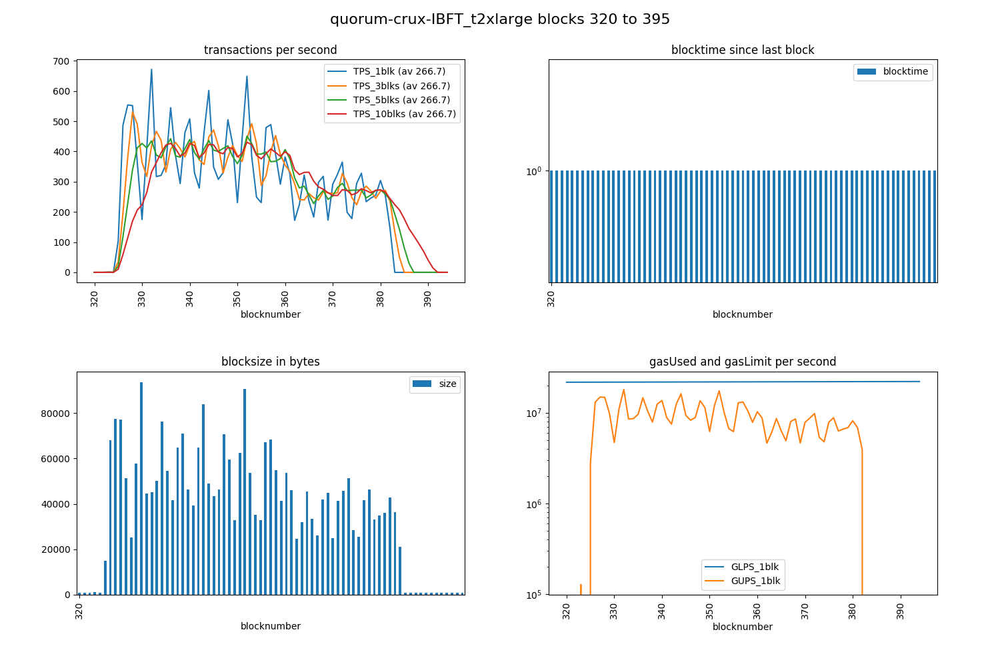
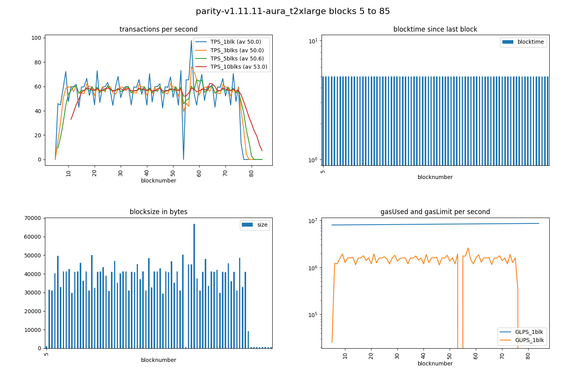

```
NEWS 2019-Feb-23 - video!
Explaining software v55 video released on youtube:
```
--> [watch](https://www.youtube.com/watch?v=xTYnsfs5U7I)


---

# chainhammer v55
TPS measurements of parity aura, geth clique, quorum, tobalaba, etc. 
It should work with any Ethereum type chain; we focused on PoA consensus.

## instructions

### video
The brand new v55 version is now explained & presented in a useful [video on youtube](https://www.youtube.com/watch?v=xTYnsfs5U7I).

### folders
* `hammer/` - submits many transactions, while watching the recent blocks
* `reader/` - reads blocks; visualizes TPS, blocktime, gas, bytes - see [reader/README.md](reader/README.md)
* `docs/` - see esp. reproduce.md
* `results/` - for each client one markdown file; `results/runs/` - auto-generated pages
* `logs/` - check this first if problems
* `networks/` - network starters & external repos via install script, see below
* `scripts/` - installers and other iseful bash scripts
* `env/` - Python virtualenv, created via install script, see below
* `tests/` - start whole integration test suite via `./pytest.sh`

### chronology
See the [results/](results/) folder:

1. [log.md](results/log.md): initial steps; also tried *Quorum's private transactions*
1. [quorum.md](results/quorum.md): raft consensus, quorum is a geth fork
1. [tobalaba.md](results/tobalaba.md): parity fork of  EnergyWebFoundation
1. [quorum-IBFT.md](results/quorum-IBFT.md): IstanbulBFT, 2nd consensus algo in quorum
1. [geth.md](results/geth.md): geth clique PoA algorithm
1. [parity.md](results/parity.md): parity aura PoA algorithm, many attempts to accelerate
1. [eos.md](results/eos.md): not begun yet
1. [substrate.md](results/substrate.md): not begun yet

## results summary

**Outdated table** in which I had run each of the experiments *manually* 
in autumn 2018; *soon* re-done completely, using the below automation. 
So please contact me *now*, if you know how to accelerate any of these clients:

| hardware  	| node type 	    | #nodes 	| config 	| peak TPS_av 	| final TPS_av 	|
|-----------	|-----------	    |--------	|--------	|-------------	|--------------	|
| t2.micro 	    | parity aura   	| 4      	| (D)    	| 45.5        	|  44.3        |
| t2.large 	    | parity aura   	| 4      	| (D)    	| 53.5        	|  52.9        |
| t2.xlarge 	| parity aura   	| 4      	| (J)    	| 57.1        	|  56.4        |
| t2.2xlarge 	| parity aura   	| 4      	| (D)    	| 57.6        	|  57.6        |
|               |                   |           |        	|         	    |              |
| t2.micro 	    | parity instantseal | 1      	| (G)    	| 42.3        	|  42.3        |
| t2.xlarge	    | parity instantseal | 1      	| (J)    	| 48.1        	|  48.1        |
|               |                   |           |        	|         	    |              |
| t2.2xlarge 	| geth clique     	| 3+1 +2    | (B)    	| 421.6       	| 400.0        |
| t2.xlarge 	| geth clique     	| 3+1 +2    | (B)    	| 386.1       	| 321.5        |
| t2.xlarge 	| geth clique     	| 3+1       | (K)    	| 372.6       	| 325.3        |
| t2.large 	    | geth clique     	| 3+1 +2    | (B)    	| 170.7       	| 169.4        |
| t2.small 	    | geth clique     	| 3+1 +2    | (B)    	|  96.8       	|  96.5        |
| t2.micro 	    | geth clique     	| 3+1       | (H)    	| 124.3       	| 122.4        |
|               |                   |           |        	|         	    |              |
| t2.micro SWAP | quorum crux IBFT 	| 4    	    | (I) SWAP! |  98.1         |  98.1   	   |
|               |                   |           |        	|         	    |              |
| t2.micro 	    | quorum crux IBFT 	| 4    	    | (F)     	| lack of RAM   |         	   |
| t2.large 	    | quorum crux IBFT 	| 4    	    | (F)    	| 207.7      	| 199.9        |
| t2.xlarge 	| quorum crux IBFT 	| 4    	    | (F)    	| 439.5      	| 395.7        |
| t2.xlarge 	| quorum crux IBFT 	| 4    	    | (L)    	| 389.1      	| 338.9        |
| t2.2xlarge 	| quorum crux IBFT 	| 4    	    | (F)    	| 435.4      	| 423.1        |
| c5.4xlarge 	| quorum crux IBFT 	| 4    	    | (F)  test_getNearestEntry()  	| 536.4      	| 524.3        |

[Reproduce](docs/reproduce.md) these results easily; for the `config` column also see there.
Quickest reproduction with my [Amazon AMI readymade image](docs/reproduce.md#readymade-amazon-ami).
And see that bottom of [parity.md](results/parity.md) and [geth.md](results/geth.md) 
and [quorum-IBFT.md](results/quorum-IBFT.md) for the latest runs, issues, and additional details.

## faster wider more
* how I initially got this faster, *on Quorum*, step by step, please do read the 1st logbook [log.md](results/log.md)
* then I improved per client, see each in [#chronology](#chronology) above
* (possible [TODOs](docs/TODO.md) - any other ideas?)

but not much more needed = the current version is already fully automated. Use it! May it help you to improve the speed of your Ethereum client!

### you
Add yourself to [other-projects.md](docs/other-projects.md) using chainhammer, or projects which are similar to this.   

(Especially if you work in one of the dev teams, you know your client code best - ) please try to improve the above results, e.g. by varying the CLI arguments with which the nodes are started; I don't see that as my job, you will be much more successful with that.

See parity [PE#9393](https://github.com/paritytech/parity-ethereum/issues/9393), parity [SE#58521](https://ethereum.stackexchange.com/questions/58521/parity-tps-optimization-please-help), geth [GE#17447](https://github.com/ethereum/go-ethereum/issues/17447), quorum [Q#479](https://github.com/jpmorganchase/quorum/issues/479#issuecomment-413603316).

*Please report back when you have done other / new measurements.*


## install and run

### quickstart
N.B.: Better do this on a *disposable cloud, or virtualbox machine*; because the installation makes lasting changes and needs sudo!  

After unpacking a ZIP of the downloaded repo, or by
```
git clone https://github.com/drandreaskrueger/chainhammer drandreaskrueger_chainhammer
ln -s drandreaskrueger_chainhammer CH
cd CH
```

you now only need these **two lines** *to prepare and run the 1st experiment!*
```
scripts/install.sh
CH_TXS=1000 CH_THREADING="sequential" ./run.sh $HOSTNAME-TestRPC testrpc
```
You will then have a diagram, and a HTML and MD page about this run!

#### activate docker 

Better now *logout & login*, or *close the terminal, and open a new terminal*, because the above scripts/install.sh might have enabled docker for the the first time for this user. Then:

#### All supported clients in one go:

For the **full integration test**, run each client for a short moment:
```
export CH_MACHINE=yourChoice
./run-all_small.sh
```

For detailed instructions, please see [reproduce.md](reproduce.md), and for troubleshooting [FAQ.md](docs/FAQ.md) and [github issues](https://github.com/drandreaskrueger/chainhammer/issues).


## unittests
```
./pytest.sh
```
enables the virtualenv, 
then starts a `testrpc-py` Ethereum simulator on http://localhost:8545 in the background, 
logging into `tests/logs/`; 
then runs `./deploy.py andtests`; 
and finally runs all the unittests, also logging into `tests/logs/`.  

(Instead of testrpc-py) if you want to run tests with another node, 
just start that; and run `pytest` manually:
```
source env/bin/activate
py.test -v --cov
```

There were 98 tests on January 23rd, all 98 PASSED
(see this [logfile](tests/logs/tests-with_testrpc-py.log.ansi)  --> 
`cat tests/logs/*.ansi` because colors) on these different Ethereum providers:  

* testrpc instantseal (`testrpc-py`)  13 seconds 
* geth Clique (`geth-dev`) 63 seconds
* quorum IBFT (`blk-io/crux`) 59 seconds
* parity instantseal (`parity-deploy`) 8 seconds
* parity aura (`parity-deploy`) 72 seconds

## credits

Please credit this as:

> benchmarking scripts "chainhammer"  
> v01-v35 financed by Electron.org.uk 2018  
> v40-v55 financed by Web3Foundation 2018-2019  
> current maintainer: Dr Andreas Krueger 2018-2019        
> https://github.com/drandreaskrueger/chainhammer   

Consider to submit your improvements & [usage](docs/other-projects.md) as pull request. Thanks.

### short summary

> The open source tools 'chainhammer' submits a high load of 
> smart contract transactions to an Ethereum based blockchain, 
> then 'chainreader' reads the whole chain, and 
> produces diagrams of TPS, blocktime, gasUsed and gasLimit, and the blocksize.
> https://github.com/drandreaskrueger/chainhammer    

---

---

---

```
# The following diagrams are outdated! Just make your own, new ones, with:
CH_MACHINE=yourChoice ./run-all_large.sh
```

## chainhammer: hammer --> reader -->  diagrams
examples:

### geth clique on AWS t2.xlarge 
[geth.md](results/geth.md) = geth (go ethereum client), "Clique" consensus.

50,000 transactions to an Amazon t2.xlarge machine.

Interesting artifact that after ~14k transactions, the speed drops considerably - but recovers again. [Reported](https://github.com/ethereum/go-ethereum/issues/17447#issuecomment-431629285).

  
reader/img/geth-clique-50kTx_t2xlarge_tps-bt-bs-gas_blks12-98.png

### quorum IBFT on AWS t2.xlarge 

[quorum-IBFT.md](results/quorum-IBFT.md) = Quorum (geth fork), IBFT consensus, 20 millions gasLimit, 1 second istanbul.blockperiod; 20000 transactions multi-threaded with 23 workers. Initial average >400 TPS then drops to below 300 TPS, see [quorum issue](https://github.com/jpmorganchase/quorum/issues/479#issuecomment-413603316))




### quorum raft
OLD RUN on a desktop machine.  

[quorum.md](results/quorum.md) = Quorum (geth fork), raft consensus, 1000 transactions multi-threaded with 23 workers, average TPS around 160 TPS, and 20 raft blocks per second)


### tobalaba
OLD RUN on a desktop machine.

[tobalaba.md](results/tobalaba.md) = Public "Tobalaba" chain of the EnergyWebFoundation (parity fork), PoA; 20k transactions; > 150 TPS if client is well-connected.


### parity aura v1.11.11 on AWS t2.xlarge 
[parity.md#run-18](results/parity.md#run-18) = 
using [parity-deploy.sh](https://github.com/paritytech/parity-deploy) 
dockerized network of 4 local nodes with increased gasLimit, and 5 seconds blocktime; 
20k transactions; ~ 60 TPS on an Amazon t2.xlarge machine.

N.B.: Could not work with parity v2 yet because of bugs 
[PD#76](https://github.com/paritytech/parity-deploy/issues/76) and 
[PE#9582](https://github.com/paritytech/parity-ethereum/issues/9582) --> 
everything still on parity v1.11.11

  
parity-v1.11.11-aura_t2xlarge_tps-bt-bs-gas_blks5-85.png


**Calling all parity experts: How to improve these too slow TPS results?**
    
See issue [PE#9393](https://github.com/paritytech/parity-ethereum/issues/9393), 
and the [detailed log of what I've tried already](results/parity.md), 
and the 2 shortest routes to reproducing the results: [reproduce.md](docs/reproduce.md).    

Thanks.
