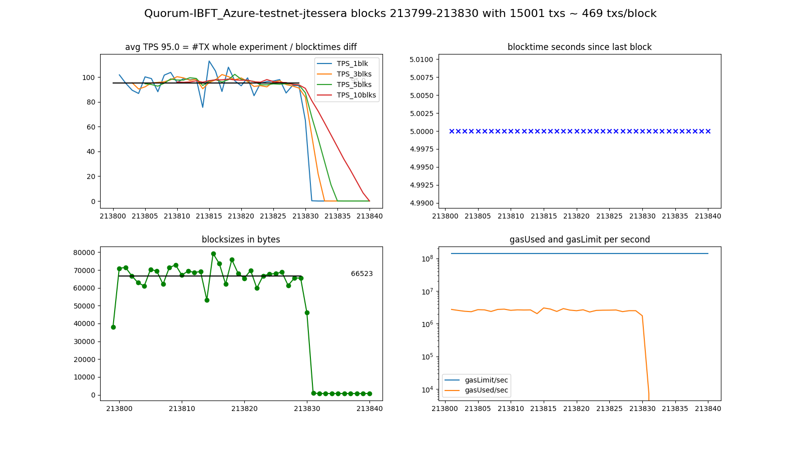

# Azure Quorum
A first benchmarking of the blockchain-as-a-service product of Microsoft. Yet unoptimized.

## preparations
Get chainhammer code, and install 
("nodocker" switch means do not install: docker, docker-compose, parity-deploy, geth-dev, quorum-crux - because we don't need to run our own network locally) 
only the needed dependencies:
```
cd drandreaskrueger
git clone https://github.com/drandreaskrueger/chainhammer
cd chainhammer
scripts/install.sh nodocker
```

Now (first only on testRPC) execute all *ten chainhammer steps* once, 
with the following `./run.sh` script.
Yes, to run all that is a bit of an overkill, but at least then you know 
that chainhammer is working fine (on testrpc://localhost:8545), 
PLUS all temp files needed by chainhammer actually exist. 
Otherwise you might later see a "FileNotFoundError: contract-address.json".
So, run this now - and watch the output with attention:
```
CH_TXS=200 CH_THREADING="sequential" ./run.sh TestRPC testrpc
```
All good? It should end with `= Ready = See that image, and those .md and .html pages. =`. 

If not, open the other log files in another terminal, perhaps that helps:
```
tail -f logs/send.py.log
tail -f logs/deploy.py.log
```
Do not move on, until the above is working fine. If unsolvable, please open a github issue.

## cloud connection attempt
Patch the two (write & read) RPCaddress'es from localhost:8545 to the wanted remote endpoint:   
```
git reset HEAD hammer/config.py
git checkout -- hammer/config.py
head -n 20 hammer/config.py

sed -i "s/RPCaddress='http:\/\/localhost:8545'/RPCaddress='https:\/\/jtessera.blockchain.azure.com:3200\/fqlf6UcrcBJPQjoX5RkAx3Nv'/g" hammer/config.py
sed -i "s/RPCaddress2='http:\/\/localhost:8545'/RPCaddress2='https:\/\/jtessera.blockchain.azure.com:3200\/fqlf6UcrcBJPQjoX5RkAx3Nv'/g" hammer/config.py
head -n 20 hammer/config.py
```

Now start a first test connection to the jtessera.blockchain.azure.com Quorum-Ethereum node:
```
source env/bin/activate
cd hammer
./is_up.py
./tps.py
```
that should say something like:
```
versions: web3 4.8.2, py-solc: 3.2.0, solc 0.4.25+commit.59dbf8f1.Linux.gpp, testrpc 1.3.5, python 3.5.3 (default, Sep 27 2018, 17:25:39) [GCC 6.3.0 20170516]
web3 connection established, blockNumber = 179499, node version string =  Geth/v1.8.12-stable/linux-amd64/go1.10.8
first account of node is 0xB7835952fbb3340A449494Ba2e6820eAffcb1220, balance is 0 Ether
nodeName: Quorum, nodeType: Geth, nodeVersion: v1.8.12-stable, consensus: istanbul, network: 1337, chainName: ???, chainId: -1

Block  179500  - waiting for something to happen
(filedate 1554740405) last contract address: 0x....
```
And then `tps.py` waits patiently, until the contract is deployed (signalled by a rewritten contract-address.json file ... done by deploy.py below).


So, now keep that script open ... and *in a second terminal*:
```
cd drandreaskrueger/chainhammer/hammer
source ../env/bin/activate

./deploy.py
```
(If deploy.py does not work, perhaps change the *networkId in your node*, and 
then add [the password here](https://github.com/drandreaskrueger/chainhammer/blob/d9be8016eade1eef82faf8b5c9054fd4c3b2f87b/hammer/clienttools.py#L166-L167).)

```
./send.py

./send.py 100
```
if sending seems to work, wait until it is ready with its 100 transactions. Then `tps.py` should end by itself - or kill it with CTRL-C.
    
You are now ready to start the full experiment:

## run experiment
Eight chainhammer steps in one go:

    cd drandreaskrueger/chainhammer
    CH_TXS=15000 CH_THREADING="threaded2 300" ./run.sh "Quorum-IBFT_Azure-testnet-jtessera"

Please let this run to the end, and don't interrupt it in the middle, otherwise you'll end up with zombie tasks. If that happens, then try `scripts/show-leftovers.sh` and kill what you can, until that script comes back empty.

Things can go wrong. Please first try to solve them by reasoning about each of the `logs/\*.log` files, then better read the chainhammer `docs/\*.md` files - and then open an issue on github with a good error description, and attached log files. Thanks a lot!

## example diagrams

Using a 5th generation i5 laptop in Europe, connecting to the Quorum blockchain node in Singapore: We could see that across half a planet, a single transaction in a non-async call took almost a whole second, when running send.py with the "sequential" algo; so in the `threaded2` algo we chose 300 multi-threading workers. 

We had difficulties in two out of three times: Once with 20k transactions, that the Quorum node lost 58 transactions and the experiment thus never ended - hopefully that can be fixed by re-configuring some Quorum switches, perhaps enlarge the transaction queue? And a different problem in another run with 30k transactions that the node suddenly "fell off the internet", and was unreachable; that experiment also never ended; no idea how to solve that - perhaps lower the number of multi-threading workers, so that the client does not overpower the server; or renice the server Quorum processes, so that it cannot freeze the whole machine? Please report back, what helped, thanks.

The experiment that actually *ran through without any problems* was this one with 15k transactions. It averaged at about 95 TPS; with a very stable blocktime of 5 seconds; blocks of average size of 469 transactions and 66523 bytes; and the gasUsed was always far below the gasLimit. See these diagrams of time series:



{'diagrams': {'blocktimestampsTpsAv': 95.04516129032258,
              'filename': 'img/Quorum-IBFT_Azure-testnet-jtessera-20190410-1800_blks213799-213830.png',
              'prefix': 'Quorum-IBFT_Azure-testnet-jtessera'},
 'node': {'chain_id': -1,
          'chain_name': '???',
          'consensus': 'istanbul',
          'name': 'Quorum',
          'network_id': 1337,
          'rpc_address': 'https://jtessera.blockchain.azure.com:3200/fqlf6UcrcBJPQjoX5RkAx3Nv',
          'type': 'Geth',
          'version': 'v1.8.12-stable',
          'web3.version.node': 'Geth/v1.8.12-stable/linux-amd64/go1.10.8'},
 'send': {'block_first': 213799,
          'block_last': 213830,
          'empty_blocks': 10,
          'num_txs': 15000,
          'sample_txs_successful': True},
 'tps': {'finalTpsAv': 87.76165110206,
         'peakTpsAv': 88.22631017031662,
         'start_epochtime': 1554912011.7372758}}

## work in progress
These results are a very first attempt, so by far not final. There are tons of things that can be tweaked. One of the big advantages of this much automated chainhammer ... is that it makes any changes measurable now, in terms of TPS and stability under heavy load. Good luck with your optimization, and please keep me in the loop - thanks.

